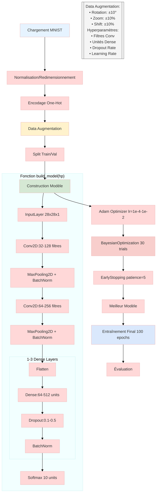
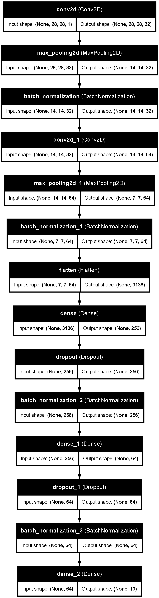

# MNIST

[link](https://mnist78.streamlit.app/)

### Architecture

## Détails 
# Architecture du Modèle CNN pour MNIST

## Couche d'Entrée (InputLayer)
- **Type de données d'entrée :** float32  
- **Forme d'entrée :** (28, 28, 1) — images MNIST en niveaux de gris

---

## Première Couche de Convolution (Conv2D)
- **Filtres :** 32  
- **Taille du noyau :** 3×3  
- **Padding :** same  
- **Stride :** 1×1  
- **Fonction d'activation :** ReLU  

**Poids :**  
- Poids du noyau : `float32[3,3,1,32]` (288 paramètres)  
- Biais : `float32[32]` (32 paramètres)

---

## Première Couche de MaxPooling (MaxPooling2D)
- **Taille de la fenêtre :** 2×2  
- **Stride :** 2×2

---

## Normalisation par Lots (BatchNormalization)
**Paramètres :**  
- Gamma : `float32[32]` (32 paramètres)  
- Bêta : `float32[32]` (32 paramètres)  
- Moyenne mobile : `float32[32]`  
- Variance mobile : `float32[32]`

---

## Deuxième Couche de Convolution (Conv2D)
- **Filtres :** 64  
- **Taille du noyau :** 3×3  
- **Padding :** same  
- **Stride :** 1×1  
- **Fonction d'activation :** ReLU  

**Poids :**  
- Poids du noyau : `float32[3,3,32,64]` (18,432 paramètres)  
- Biais : `float32[64]` (64 paramètres)

---

## Deuxième Couche de MaxPooling (MaxPooling2D)
- **Taille de la fenêtre :** 2×2  
- **Stride :** 2×2

---

## Normalisation par Lots (BatchNormalization)
**Paramètres :**  
- Gamma : `float32[64]` (64 paramètres)  
- Bêta : `float32[64]` (64 paramètres)  
- Moyenne mobile : `float32[64]`  
- Variance mobile : `float32[64]`

---

## Couche de Mise à Plat (Flatten)
- Transforme les caractéristiques 3D en vecteur 1D pour les couches denses

---

## Première Couche Dense (Dense)
- **Unités :** 256  
- **Fonction d'activation :** SELU  

**Poids :**  
- Poids : `float32[3136,256]` (802,816 paramètres)  
- Biais : `float32[256]` (256 paramètres)

---

## Couche de Dropout
- **Taux de dropout :** 0.2 (20% des neurones désactivés aléatoirement)

---

## Normalisation par Lots (BatchNormalization)
**Paramètres :**  
- Gamma : `float32[256]`  
- Bêta : `float32[256]`  
- Moyenne mobile : `float32[256]`  
- Variance mobile : `float32[256]`

---

## Couche de Sortie (Dense)
- **Unités :** 10 (correspond aux 10 classes MNIST)  
- **Fonction d'activation :** Softmax  

**Poids :**  
- Poids : `float32[256,10]` (2,560 paramètres)  
- Biais : `float32[10]` (10 paramètres)

